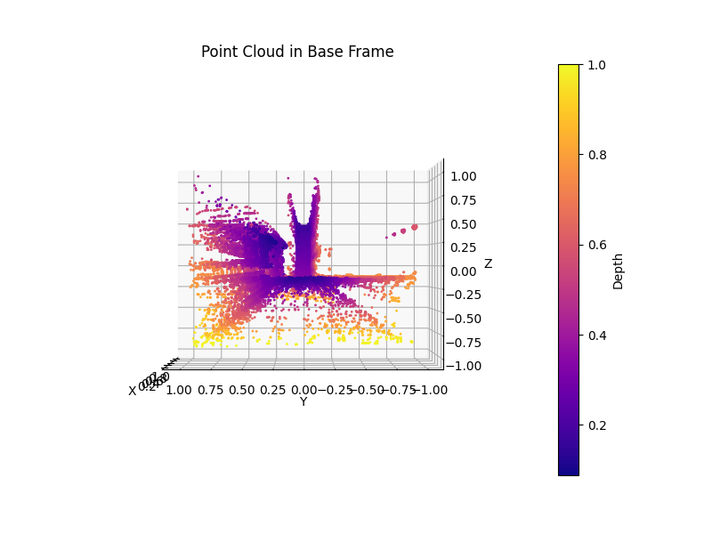

# Disparity-to-Point-Cloud
3D point cloud of a disparity image in camera frame and base frame.

# 3D Point Calculation

$$
z = \frac{{f_x \cdot B}}{{D(u,v)}}
$$

$$
x = \frac{{(u - c_x) \cdot z}}{{f_x}}
$$

$$
y = \frac{{(v - c_y) \cdot z}}{{f_y}}
$$

Where:
- $D(u,v)$ is the disparity at pixel $(u,v)$,
- $B$ is the baseline distance between the stereo camera pair,
- $(u,v)$ are the pixel coordinates,
- $(c_x, c_y)$ are the principal point coordinates,
- $(f_x, f_y)$ are the focal lengths along the x and y axes.

# Disparity Image and its 3D Points Cloud

  

  

    
    
$P_c$: 3D Points cloud in camera frame

  

  

    
    
$P_b$: 3D Points cloud in base frame

  

$$
P_b = R^b_c \cdot P_c 
$$
