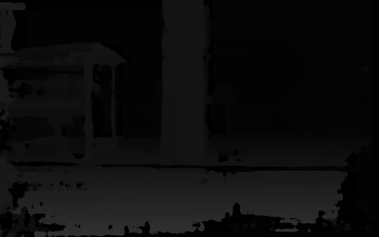

# Disparity-to-Point-Cloud
3D point cloud of a disparity image in camera frame and robot base frame.

# Disparity image and it's 3D points cloud

  

  

    
    
Camera Frame

  

  

    
    
Base Frame

  

